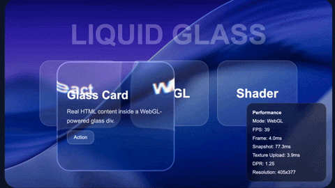

# 🪟 Liquid Glass

A lightweight, modular library for **liquid glass** effects on HTML elements. The page background is captured with `html2canvas`, the region under the glass is cropped, and **WebGL2** processes it with GLSL shaders — blur, lens distortion, zoom, chromatic aberration, frost, and a CSS fallback when GPU capture is unavailable.



---

## ✨ Introduction

Use `createLiquidGlass()` to add a glass layer over your DOM: HTML inside `glass` renders normally, while the frosted/transparent background in that area is simulated via canvas and shaders.

## Live Demo

https://aajafari87.github.io/liquid-glass-webgl/

**How it works:**

1. 📸 Snapshot the `container` with `html2canvas`
2. ✂️ Crop the region under `glass` and upload it as a WebGL texture
3. 🎨 Render the effect in `fragment.glsl` (blur, lens distortion, frost, edge light)
4. 🔄 If WebGL2 is missing or capture fails → show the `fallback` element with CSS

```html
<script src="https://cdn.jsdelivr.net/npm/html2canvas@1.4.1/dist/html2canvas.min.js"></script>
<script type="module">
  import { createLiquidGlass } from "./src/glass-effect.js";

  createLiquidGlass({
    container: "#container",
    glass: "#glass",
    canvas: "#glassCanvas",
    fallback: "#glassFallback",
    effect: { radius: 45, blur: 50 },
    performance: { targetFps: 30 }
  });
</script>
```

---

## 🌐 Demo

Run locally from the project root:

```bash
python3 -m http.server 5173
```

Then open:

**http://localhost:5173/demo/index.html**

Shaders are loaded with `fetch`, so a local server is required — see [Local files](#local-files) under [Limitations](#limitations).

---

## 📁 Project structure

```
glass-effect/
├── docs/                    # 🖥️  Sample page and styles
│   ├── index.html
│   └── styles.css
├── src/
│   ├── glass-effect.js      # ⚙️  Entry point: WebGL, render loop, capture
│   ├── shaders/
│   │   ├── vertex.glsl      # 📐  Full-screen triangle
│   │   └── fragment.glsl  # 🎨  Glass effect (SDF, blur, distortion, …)
│   └── utils/
│       ├── config.js        # 🔧  Maps UI values (0–100) to shader uniforms
│       ├── dom-capture.js   # 📸  html2canvas wrapper
│       └── performance.js   # 📊  FPS and frame-time monitor
└── LICENSE
```

| Technology | Role |
|------------|------|
| **Vanilla JS (ES Modules)** | No bundler; direct `import` |
| **WebGL2** | GPU rendering and uniforms |
| **GLSL 300 es** | Vertex and fragment shaders |
| **html2canvas** | DOM screenshot (CDN dependency) |
| **ResizeObserver** | Sync canvas size when layout changes |

---

## 💻 About the code

The core lives in `glass-effect.js`: shaders are loaded with `fetch`, the WebGL program is linked, and each frame (throttled by `targetFps`) updates the texture only when the `glass` element’s position or size changes. `fragment.glsl` clips the glass shape with a **rounded-corner SDF**, applies lens-style distortion and Gaussian blur, and layers frost (noise), edge lighting, and chromatic aberration. Values in `effect` are mapped in `config.js` from a **0–100** range (slider-friendly) to the actual shader uniforms.

---

## ⚙️ API — `createLiquidGlass(options)`

### 🔗 DOM selectors (required)

| Parameter | Type | Description |
|-----------|------|-------------|
| `container` | `string` | Selector for the element whose background is captured (e.g. `"#container"`) |
| `glass` | `string` | Selector for the glass layer (position and size define the texture crop) |
| `canvas` | `string` | Selector for the `<canvas>` inside `glass` used for WebGL rendering |
| `fallback` | `string` | Selector for the CSS element shown when WebGL or capture is unavailable |

### 📊 `performanceBox` (optional)

Maps keys to span selectors for displaying stats in the demo:

| Key | Description |
|-----|-------------|
| `mode` | Current mode (`WebGL` or fallback reason) |
| `fps` | Frames per second |
| `frame` | Time to render one frame (ms) |
| `snapshot` | Time of the last `html2canvas` call (ms) |
| `upload` | Texture upload time (ms) |
| `dpr` | Effective device pixel ratio |
| `resolution` | Canvas dimensions in pixels |

### 🎛️ `effect` (optional)

All values below are **numbers from 0 to 100** (like UI sliders). Default shown in parentheses.

| Parameter | Default | Effect |
|-----------|---------|--------|
| `radius` | `45` | Corner radius of the glass shape (mapped to pixels) |
| `blur` | `50` | Strength of Gaussian blur on the background |
| `distortion` | `30` | Lens-style edge distortion intensity |
| `zoom` | `35` | Magnification of content under the glass |
| `chromaticAberration` | `20` | RGB separation at the edges |
| `frost` | `8` | Frost noise texture strength |
| `frostScale` | `50` | Scale / tiling of the frost noise |
| `light` | `30` | Edge highlight / specular light strength |
| `edgeGlow` | `40` | Rim glow intensity |
| `edgeWidth` | `25` | Width of the glowing edge band |
| `tint` | `94` | Overall brightness / color tone (higher ≈ brighter) |
| `alpha` | `97` | Output opacity of the shader |

> `lightDirection` is fixed in the current version (`-0.7`, `-1.0` in `config.js`) and cannot be set via `options`.

### ⚡ `performance` (optional)

| Parameter | Default | Description |
|-----------|---------|-------------|
| `maxDpr` | `1.25` | Cap on `devicePixelRatio` for the canvas (limits GPU cost) |
| `targetFps` | `30` | Maximum render update rate |
| `animateGlass` | `false` | In the demo: moves `glass` to stress-test performance |

### ↩️ Return value

```js
const api = createLiquidGlass({ /* ... */ });
// api.refresh()     — re-capture snapshot from container
// api.fallback(reason) — manually enable CSS fallback mode
```

---

## ⚠️ Limitations

### 🖼️ Cross-origin images

External images must allow **CORS**. Otherwise the browser will **taint** the canvas and texture uploads will fail (the library switches to CSS fallback).

### 📂 Local files

Opening the demo directly using `file://` is **not supported**. Shaders and modules are loaded via `fetch` from relative paths — use a local server instead (see [Demo](#demo)).

### 🐢 Performance cost

The effect requires:

- DOM capture (`html2canvas`)
- Texture upload
- WebGL rendering
- Blur sampling in the fragment shader

Large glass surfaces and high blur values may impact performance on low-end devices. Snapshots are also costly on large DOMs; they run mainly on resize or when the glass moves. Call `api.refresh()` when content behind the glass changes — updates are not automatic.

### 🎨 CSS fallback

When WebGL2 is unavailable (or capture / texture upload fails), the effect automatically falls back to **CSS-based** glass rendering on the `fallback` element.

The CSS fallback does **not** support:

- Distortion
- Zoom
- Chromatic aberration
- Frost effect


### 📦 Other constraints

| Topic | Details |
|-------|---------|
| **html2canvas** | Must be loaded before importing this module (CDN or bundle) |
| **WebGL2** | Required for the full shader pipeline |
| **Video / iframe** | Capture is limited to what html2canvas supports |
| **Mobile** | High DPR and shader blur can be heavy on weaker devices |

---

## 📜 Licence

This project is released under the **[MIT License](LICENSE)**.